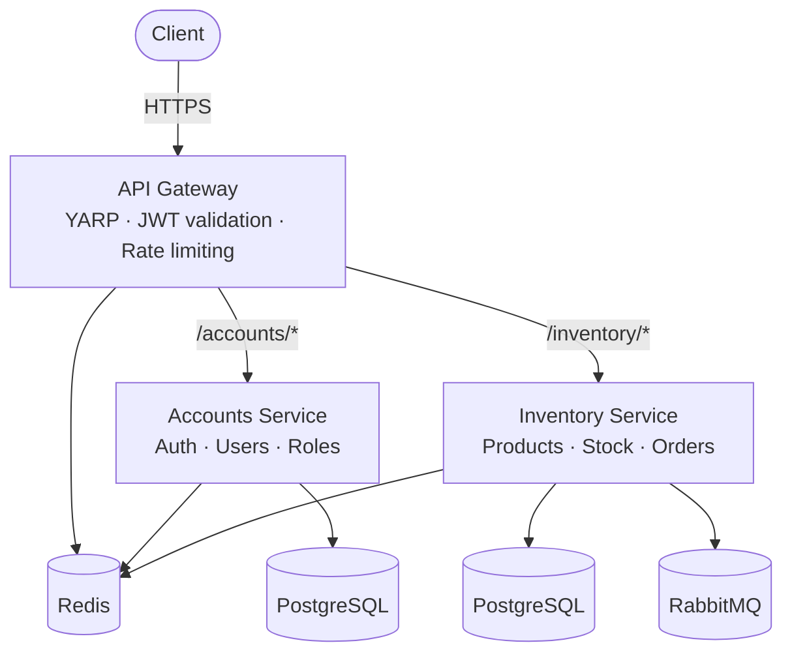
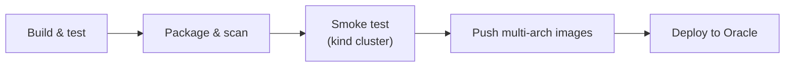

# IMS — Inventory Management System

A microservices-based inventory management backend built with **.NET 10**, demonstrating clean architecture, asynchronous messaging, real-time updates, and a full production-style deployment on Kubernetes — from a local `docker compose up` to a live Kubernetes cluster on Oracle Cloud with CI/CD, monitoring, and automated backups.

[](https://github.com/KRONEY-dev/IMS/actions/workflows/build-and-test.yml)
[](https://dotnet.microsoft.com/)
[](LICENSE)

---

## Live deployment

The `main` branch deploys automatically to a live single-node Kubernetes cluster on Oracle Cloud:

| | |
|---|---|
| API health check | [ims-main.duckdns.org/health/ready](https://ims-main.duckdns.org/health/ready) |
| Grafana dashboards | [ims-grafana.duckdns.org](https://ims-grafana.duckdns.org) |
| Interactive API docs (Scalar) | `/scalar` — a single hub covering Accounts, Inventory, and the Gateway's own admin API; IP-allowlisted, not publicly browsable (current demo instance only) |

The docs allowlist is enforced independently of JWT auth, since a live "try it" API surface is a map of the whole system for anyone who reaches it — see [Security highlights](#security-highlights) below. The demo instance currently restricts it to a small set of networks; that's a configuration choice for this instance, not a limitation of the feature itself.

---

## Architecture



Redis backs the access-token blacklist, rate limiting, distributed locks, and the SignalR backplane. RabbitMQ carries a transactional outbox used for one specific async path (low-stock evaluation after a stock change) — not a system-wide event bus. Prometheus scrapes metrics from all three application services; Grafana visualizes them.

Three deployable services, each its own Docker image and database:

| Service | Responsibility |
|---|---|
| **ApiGateway** | Single entry point (YARP) — JWT signature validation, rate limiting, IP-restricted docs, Swagger/Scalar aggregation |
| **AccountsService** | Registration/login, JWT (RS256) + refresh token rotation with reuse detection, roles, warehouse access |
| **InventoryService** | Products, warehouses, stock, transfers, supplier orders, low-stock alerts, real-time updates |

Each service follows **Clean Architecture** as four separate `.csproj` layers (`Domain` → `Application` → `Infrastructure`/`API`), so the dependency rule is enforced by the compiler, not convention.

---

## Tech stack

| Category | Technology |
|---|---|
| Runtime | .NET 10, ASP.NET Core |
| Data access | EF Core + PostgreSQL, code-first migrations |
| Auth | JWT (RS256), refresh-token rotation with reuse detection, Redis-backed access-token blacklist |
| Caching / ephemeral state | Redis (rate limiting via an atomic Lua script, distributed locks, SignalR backplane) |
| Messaging | RabbitMQ with a transactional outbox for at-least-once delivery |
| Scheduling | Quartz.NET |
| Real-time | SignalR, scaled via Redis backplane |
| Gateway | YARP reverse proxy |
| Containers | Docker, Docker Compose (local), Kubernetes + Helm (production) |
| CI/CD | GitHub Actions — build, test, Trivy image scanning, migration-safety checks, Kubernetes smoke test, deploy |
| Observability | Prometheus, Grafana, Alertmanager (email alerts) |
| Testing | xUnit + Moq (unit), Testcontainers (Postgres/Redis/RabbitMQ integration tests, real concurrency races) |

---

## What this demonstrates

- **Clean Architecture** with the dependency rule enforced by separate compiled projects per layer, not just folders
- **Concurrency correctness proven, not assumed** — atomic conditional `UPDATE`s for hot paths (stock quantity, refresh-token rotation), verified under genuine concurrent load with Testcontainers rather than trusted by inspection
- **JWT auth done narrowly** — signature verification happens in exactly one place (the Gateway); downstream services only decode already-trusted claims
- **Reliable async messaging** — a transactional outbox + RabbitMQ for at-least-once delivery with idempotent consumers, used where a request shouldn't block on a side effect
- **Real-time updates** — SignalR with per-warehouse group scoping, backed by a Redis pub/sub channel that propagates access revocation across services live
- **Infrastructure as code** — the same application ships via Docker Compose locally and a parameterized Helm chart in Kubernetes, with CI validating both
- **A CI/CD pipeline that actually gates on safety** — pending-migration checks, a full Kubernetes smoke-test deploy, and image vulnerability scanning run before anything reaches the live cluster

### Security highlights

- RS256 JWT with signature validation centralized at the Gateway only
- Refresh-token rotation with reuse detection (stolen/replayed token invalidates the whole session)
- Redis-backed rate limiting on login/refresh via an atomic Lua script (no INCR+EXPIRE race)
- Interactive API docs gated by a separate, JWT-independent IP allowlist (the live demo currently keeps this locked down to a small network list)
- Access-token blacklist and cross-service access revocation (role/warehouse/password changes propagate live via Redis pub/sub, including forcing an active SignalR connection to disconnect)

---

## Project structure

```
IMS/
├── AccountsService/           # Domain / Application / Infrastructure / API / Tests
├── InventoryService/          # Domain / Application / Infrastructure / API / Tests
├── ApiGateway/                # YARP gateway, auth, rate limiting, docs allowlist
├── ApiGateway.Tests/
├── Shared.Kernel*/            # Cross-cutting building blocks (EF Core, Redis, AspNetCore, Quartz)
├── Shared.Contracts/          # Wire contracts for cross-service events
├── charts/                    # Helm charts (application + monitoring stack)
├── scripts/                   # Bootstrap and maintenance scripts (C# script files, Oracle setup)
├── .github/workflows/         # CI/CD pipeline
└── docker-compose.yml
```

---

## Deployment

The same Helm chart (`charts/ims`) deploys to two targets — a disposable `kind` cluster for CI verification and the live Oracle Cloud cluster — parameterized entirely through Helm values files, with no code or Dockerfile differences between them.



Migration checks and image builds actually run in parallel, and a failed post-deploy health check triggers an automatic `helm rollback` — the full job graph:

1. **`build-and-test`** — restores and builds the whole solution, runs all four test projects, and fails the build if a domain-model change is missing its EF Core migration.
2. **`migrate-check`** and **`build-images`** run in parallel once `build-and-test` passes:
   - `migrate-check` applies every migration to a fresh Postgres instance from scratch.
   - `build-images` builds all five Docker images (`amd64`) in parallel via a matrix, each with its own GitHub Actions cache scope so one service's changes never invalidate another's layer cache, then scans every image with Trivy and publishes results to the repo's Security tab.
3. **`helm-deploy-smoke-test`** — spins up a real, disposable Kubernetes cluster (`kind`), installs the exact same Helm chart used in production with the images just built, and sends real HTTP requests through the Gateway. Nothing is published as a release image or reaches the live server until this passes.
4. **`build-and-push-images`** *(on push to `main` only)* — rebuilds each image for both `amd64` and `arm64` in parallel (a 5×2 matrix), reusing the per-image cache scopes from step 2, then **`publish-multiarch-manifests`** combines each pair into one multi-arch image tag.
5. **`deploy-to-oracle`** — deploys the new images to the live cluster over SSH, verifies `/health/ready` actually returns 200 afterward, and automatically runs `helm rollback` with a second health check if it doesn't — no manual intervention for a bad deploy. A concurrency group ensures two pushes in quick succession can't race each other's deploy.

---

## Running locally

Requirements: Docker and Docker Compose.

```bash
docker compose up --build
```

This builds and starts all seven services (two APIs + their Postgres databases, Redis, RabbitMQ, and the Gateway), running EF Core migrations automatically before the APIs start. The Gateway is the only exposed port:

- API: `https://localhost:8081`
- Interactive docs (all services in one hub): `https://localhost:8081/scalar` (allowed by default from `localhost`)
- RabbitMQ management UI: `http://localhost:15672`

## Running the tests

```bash
dotnet test AccountsService/AccountsService.Tests/AccountsService.Tests.csproj
dotnet test InventoryService/InventoryService.Tests/InventoryService.Tests.csproj
dotnet test ApiGateway.Tests/ApiGateway.Tests.csproj
dotnet test Shared.Kernel.Redis.Tests/Shared.Kernel.Redis.Tests.csproj
```

Integration tests spin up real Postgres/Redis/RabbitMQ containers via Testcontainers (Docker required) — no mocked infrastructure for anything that touches concurrency guarantees.

---

## License

[MIT](LICENSE)
